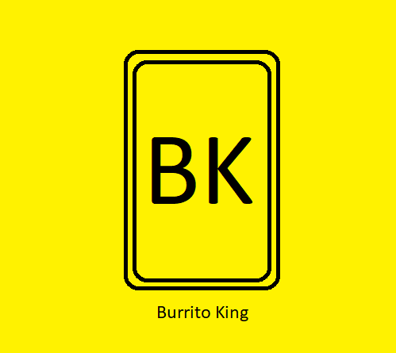

<h1>Assignment 2 - Advanced Programming</h1>

This assignment contains the repository for assignment 2. The last commit to this repository before the due date should be considered my submission for assignment. Following this course's submission and successful completion, I will also port this code to my own personal GitHub repository.

    

        
    

    

<h3>Tech-Stack:</h3>
<ul>
<li>Program Developed using Eclipse IDE</li>
<li>Java Development Kit Version: 17</li>
<li>JavaFX version: 22.0.1</li>
<li>Database: SQLite</li>
<li>JDBC driver version: 3.27.21.1 from https://mvnrepository.com/artifact/org.xerial/sqlite-jdbc</li>
<li>GUI developed using SceneBuilder and FXML files</li>
<li>Very minor CSS styling in "/src/application.css"</li>
</ul>

<h3>Functionality/Choices:</h3>
All major functionality and exception handling per assignment specifications.
Exception handling is managed through the view/controller. This keeps the model safe from user volatility.
The time for Picking up orders is specified by using the system date and time instead of the user's (the user has to wait until the order is ready in real-time (instead of inputting a pickup time). I thought learning about the Java system date and time was a bit more interesting than another string error-handling task.

<h3>Usage:</h3>
Application run in Eclipse IDE from file:
<b>'/src/application/main.java'</b>

<b>Note:</b> The application was built on Windows OS. There may be some compatibility issues in a MacOS or *nix environment. I could not get my DB connection working early in the development cycle in MacOS, which is why this was developed in Windows. 

<h3>Design Explanation and Choices:</h3>
<a href = "/GlobalMVCDesign.pdf">GlobalMVCDesign.pdf</a> contains a visual guide for the Model-View-Controller architecture.
<a href = "/DBDesignBurritoKing.pdf">DBDesignBurritoKing.pdf</a> shows the SQLite database structure, and the SQL queries used to create these tables in SQLite3 can be seen in program files.
<a href = "/ControllerOOPDesign.pdf">ControllerOOPDesign.pdf</a> demonstrates how I have used polymorphism and inheritance from AppController, SecureAppController and different interfaces that these programs have implemented.
<a href = "/DatabaseConnectionOOPDesign.pdf">DatabaseConnectionOOPDesign.pdf</a> demonstrates how the backend has used polymorphism and SOLID interface principles, as well as implementing the ConnectMediator to mediate interaction with the database.
 
 
The application follows the Model-View-Controller design pattern. Relevant controllers handle data sent to and from the model. Due to the constraints of FXML, separate controllers were made across different files as the FXML files cannot access non-public classes. A singleton design for the AppService interface is implemented by fetching one recurrent User, Order, Kitchen, and PointOfService as required. These are attributes in AppController that are inherited. The connection to the database is handled through a single Connect class that provides simple methods for making connections and sending/receiving data from the SQL-lite database. Data is sent and received as it is finalised (i.e., the order is fully confirmed). This was made for stability and for returning to a state after the program crashes.
 
 
<b>Note:</b> While I recognise that the factory pattern is used in creating a TableColumn in FXML, this is implemented by the Java libraries (PropertyValueFactory and setCellValueFactory), which are standard methods in the FX library and thus do not contribute towards my OO choices.
